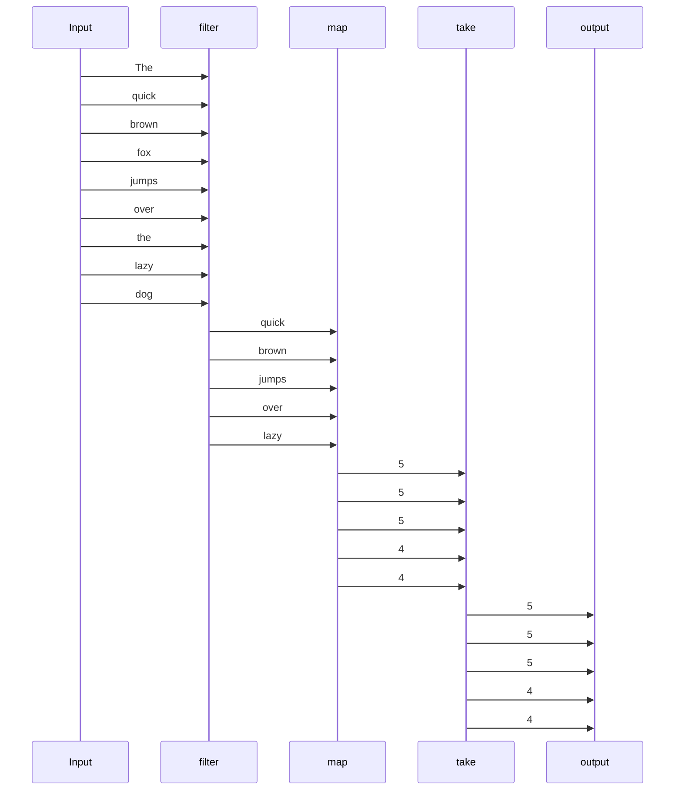
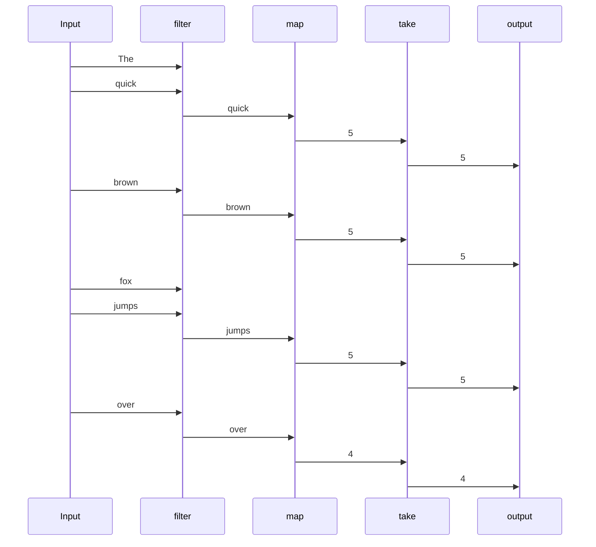

- Iterable
23 Steps

```mermaid
sequenceDiagram
    participant Input
    participant filter
    participant map
    participant take
    participant output

    Input ->> filter: The
    Input ->> filter: quick
    Input ->> filter: brown
    Input ->> filter: fox
    Input ->> filter: jumps
    Input ->> filter: over
    Input ->> filter: the
    Input ->> filter: lazy
    Input ->> filter: dog

    filter ->> map: quick
    filter ->> map: brown
    filter ->> map: jumps
    filter ->> map: over
    filter ->> map: lazy

    map ->> take: 5
    map ->> take: 5
    map ->> take: 5
    map ->> take: 4
    map ->> take: 4

    take ->> output: 5
    take ->> output: 5
    take ->> output: 5
    take ->> output: 4
    take ->> output: 4
```
- Sequence
18 Steps

```mermaid
sequenceDiagram
    participant Input
    participant filter
    participant map
    participant take
    participant output


    Input ->> filter: The

    Input ->> filter: quick
    filter ->> map: quick
    map ->> take: 5
    take ->> output: 5

    Input ->> filter: brown
    filter ->> map: brown
    map ->> take: 5
    take ->> output: 5

    Input ->> filter: fox

    Input ->> filter: jumps
    filter ->> map: jumps
    map ->> take: 5
    take ->> output: 5

    Input ->> filter: over
    filter ->> map: over
    map ->> take: 4
    take ->> output: 4
```